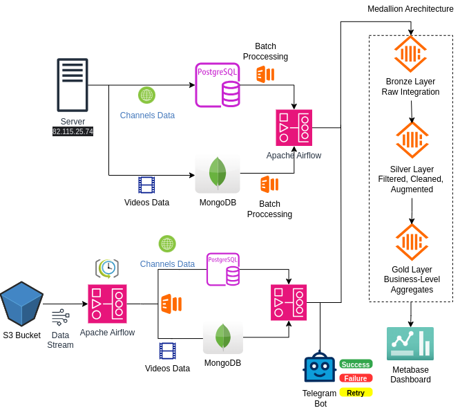

# YouTube Content Management Project

## Overview
This project focuses on building a robust data pipeline for managing and analyzing YouTube content data. The project is divided into two phases, each with specific goals and deliverables.

## Phase 1: Data Pipeline Setup and Management
The primary objective of Phase 1 is to establish a comprehensive data pipeline for processing and analyzing pre-extracted YouTube data. Key tasks include:

1. **Data Preparation**: Work with pre-extracted YouTube data (no APIs are used in this phase).
2. **Database Setup**: Configure and set up PostgreSQL and MongoDB for structured and unstructured data storage.
3. **Data Loading**: Load the pre-extracted data into the databases using various methods.
4. **Workflow Management**: Use Apache Airflow to orchestrate and manage the data pipeline workflow.
5. **Data Analysis**: Transfer the processed data to ClickHouse for efficient and scalable final analysis.

## Phase 2: Automation and Analytics
In Phase 2, the focus shifts to enhancing the pipeline and providing actionable insights through automation and visualization. Key tasks include:

1. **Process Automation**: Implement automation to streamline data processing and reduce manual intervention.
2. **Incremental Processing**: Support incremental data processing to handle updates efficiently.
3. **Analytical Dashboards**: Build interactive dashboards using Metabase to visualize insights and trends from the analyzed data.

## Tools and Technologies
- **Databases**: PostgreSQL, MongoDB, ClickHouse
- **Workflow Management**: Apache Airflow
- **Data Visualization**: Metabase
- **Programming Languages**: Python, SQL
- **Other Tools**: Docker

## Directory Structure
    YouTubeContentManagement-DataEng/
        ├── config/
        ├── data/
        │   ├── raw/
        │   ├── processed/
        ├── databases/
        │   ├── mongodb/
        │   │   ├── init_data_mongo.py
        │   │   └── README.md
        │   ├── postgres/
        │   ├── clickhouse/
        ├── docker/
        │   ├── Dockerfile
        │   └── docker-compose.yaml
        ├── workflows/
        │   ├── tasks/
        │   ├── utils/
        │   └── dags/
        ├── scripts/
        │   ├── data_loading/
        │   ├── data_analysis/
        ├── requirements.txt
        └── README.md

## Getting Started
To set up and run this project locally, follow the instructions in the Setup Guide.

## Contributing
Contributions are welcome! Please read the Contribution Guidelines for details on how to get started.

## License
This project is licensed under the MIT License.
