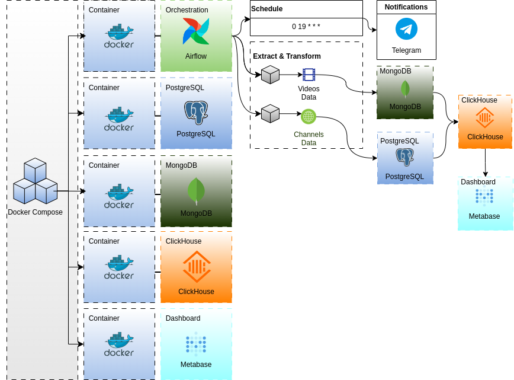

# Docker Compose Setup for Apache Airflow with MongoDB, PostgreSQL, ClickHouse and Metabase.

## Overview
This Dockerfile sets up the environment needed to run Apache Airflow with dependencies for MongoDB and ClickHouse.

## Dockerfile Explanation
- **Base Image**: Official Apache Airflow image (2.10.4).
- **Installations**: Includes sudo, build-essential, and necessary Python packages (apache-airflow-providers-mongo, pymongo, clickhouse-driver, boto3, python-telegram-bot).
- **User Permissions**: Switches to root for installations, then back to airflow user for running processes.

## Installation

### Using Docker and Docker Compose
1. Clone this repository.
2. Build and deploy the Docker image:
    ```bash
    docker-compose up --build
    ```

## Docker Compose Configuration
The `docker-compose.yml` file sets up the necessary services for running Airflow with MongoDB and ClickHouse.

### Services
- **Postgres**: 
  - Image: `postgres:13`
  - Ports: 5432:5432
  - Volumes for data persistence.
  - Healthchecks and resource limits.
- **Redis**: 
  - Image: `redis:7.2-bookworm`
  - Exposes port 6379.
- **Mongo**: 
  - Image: `mongo:4.4`
  - Ports: 27017:27017
  - Volumes for data persistence.
- **ClickHouse**: 
  - Image: `clickhouse/clickhouse-server:23.7.6-alpine`
  - Ports: 8123, 9000, 9009
  - Volumes for data persistence.
- **Metabase**: 
  - Image: `lucasluanp/metabase-with-clickhouse`
  - Ports: 3000:3000
  - Environment variables for Metabase configuration.
- **Airflow Services**: 
  - Common setup defined in `x-airflow-common`.
  - Volumes mapped for Airflow directories.
  - Services include Webserver, Scheduler, Worker, Triggerer.
- **Flower (Optional)**: 
  - Monitors Celery workers.
  - Exposes port 5555.

## Usage
1. Place your DAG file in the Airflow DAGs folder.
2. Start services:
    ```bash
    docker-compose up -d
    ```
3. Access the Airflow web interface at [http://localhost:9090](http://localhost:9090).
4. Trigger the DAG manually or wait for the scheduled run.

## Notes
- Ensure Airflow connections are set up for MongoDB (`MONGO_CONN_ID`) and ClickHouse.
- Adjust packages in the Dockerfile as needed.


